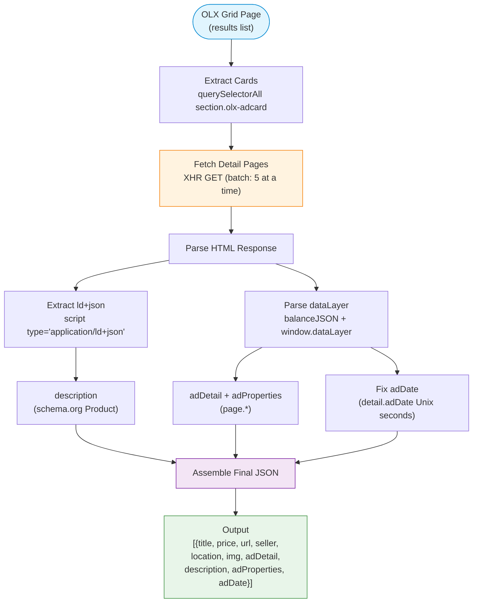
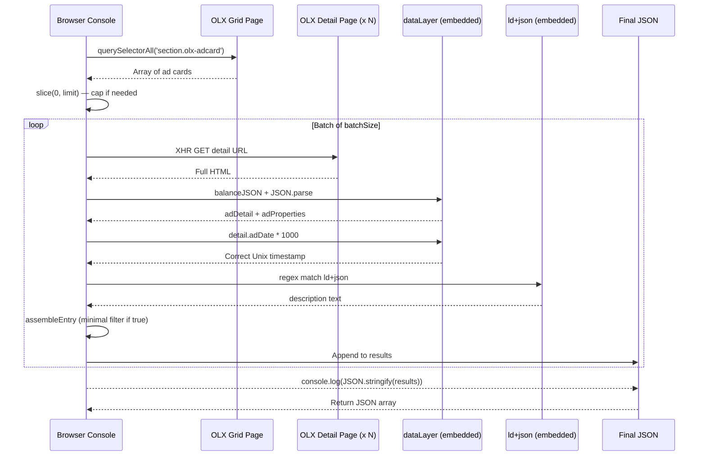

<div align="center">

# OLX Scraper

**Self-contained, zero-dependency classifieds scraper for OLX**

Paste into your browser console — no npm, no build, no setup.

[](LICENSE)
[](https://developer.mozilla.org/en-US/docs/Web/JavaScript)
[](CONTRIBUTING.md)
[](https://developer.mozilla.org/en-US/docs/Web/API/Window)
[](https://www.olx.com.br)
[](package.json)
[](https://github.com/klimadev/olx-scraper/releases)
[](https://github.com/klimadev/olx-scraper/actions/workflows/release.yml)
[](https://www.google.com/maps/place/Brazil)

</div>

---

## Overview

**OLX Scraper** is a lightweight, single-file script that extracts every listing from any [OLX](https://www.olx.com.br) search results page — including the **full ad detail JSON**, **description text**, and **structured property specs** — without a single external dependency.

Unlike traditional web scrapers that require Node.js, Puppeteer, or Playwright, this script runs directly in your browser console. It works across all OLX subdomains (`www.olx.com.br`, `sp.olx.com.br`, `rj.olx.com.br`, etc.) by leveraging OLX's own internal APIs.

> **Why this exists:** There was no open-source, reliable way to extract structured data from OLX. Existing solutions break on OLX's front-end changes, require heavy tooling, or miss critical fields like `adDate`, `description`, and the complete `adDetail` payload. This scraper was built from the ground up by reverse-engineering OLX's client-side data layer.

---

## Features

- **Zero dependencies** — no npm, no Docker, no Puppeteer. Just copy and paste.
- **Class-based API** — use `OlxScraper.extract()` with optional `limit` and `minimal` mode.
- **Works on any OLX category** — cars, real estate, computers, jobs, anything.
- **Full data extraction** — captures title, price, URL, seller, location, image, plus the **complete `adDetail` JSON object**.
- **Minimal mode** — get only the essentials: seller, location, date, title, URL, and description.
- **Correct adDate** — OLX serializes dates incorrectly; this scraper fixes the epoch offset using the accurate timestamp from `dataLayer[0].page.detail.adDate`.
- **Description parsing** — extracts descriptions from the schema.org `application/ld+json` block.
- **Structured specs** — extracts the `adProperties` array, giving you every labeled attribute OLX stores for a listing.
- **Batch processing** — fetches detail pages 5 at a time to avoid overwhelming the browser.
- **Cross-subdomain** — works seamlessly across all regional OLX subdomains thanks to OLX's permissive CORS policy.
- **Human-readable output** — prints a formatted JSON array to the console, ready for copy-paste or further processing.

---

## Quick Start

1. Open your browser and navigate to any OLX search results page (e.g., [computers in São Paulo](https://sp.olx.com.br/grande-sp/sao-paulo/informatica/computadores)).
2. Open the **developer console**:
   - Chrome: `Ctrl + Shift + J` (Windows/Linux) or `Cmd + Option + J` (macOS)
   - Firefox: `Ctrl + Shift + K` (Windows/Linux) or `Cmd + Option + K` (macOS)
3. Copy the entire script from [`olx-scraper.js`](olx-scraper.js) and paste it into the console.
4. Press `Enter`.

The script auto-executes and scrapes all visible listings. Once finished, a JSON array is printed to the console.

```json

=== RESULTADO FINAL ===
[
  {
    "title": "Computador i5-10400f, 16GB RAM, HD 1TB",
    "price": "R$ 1.400",
    "url": "https://sp.olx.com.br/sao-paulo/computador-i5-10400f-16gb-ram-hd-1tb-sem-placa-de-video-123456789",
    "seller": "João Silva",
    "location": "São Paulo - SP",
    "img": "https://img.olx.com.br/images/...",
    "adDetail": { "subject": "Computador i5-10400f...", "price": 1400, ... },
    "description": "Computador com processador Intel Core i5-10400F...",
    "adProperties": [
      { "label": "Processador", "value": "Intel Core i5-10400F" },
      { "label": "Memória RAM", "value": "16 GB" }
    ],
    "adDate": "2025-10-28 14:30:00"
  }
]
```

> **Tip:** To save the output as a file, type `copy(JSON.stringify(results))` after the script finishes — this copies the full JSON array to your clipboard.

---

## API Reference

The script exposes a global `OlxScraper` class. Call it again anytime with custom options:

```js
// Full output, no limit, 10 pages (default)
OlxScraper.extract();

// Limit to 10 listings total
OlxScraper.extract({ limit: 10 });

// Minimal mode — only the essentials
OlxScraper.extract({ minimal: true });

// Scrape 5 pages starting from page 3
OlxScraper.extract({ pages: 5, offset: 2 });

// Combined
OlxScraper.extract({ pages: 3, limit: 50, minimal: true });
```

### `OlxScraper.extract(options)`

| Option | Type | Default | Description |
|---|---|---|---|
| `limit` | `number` | `Infinity` | Maximum number of listings to return |
| `minimal` | `boolean` | `false` | When `true`, return only `seller`, `location`, `adDate`, `title`, `url`, `description` |
| `pages` | `number` | `10` | Number of search result pages to scrape |
| `offset` | `number` | `0` | Skip this many pages before starting (0 = start at page 1) |
| `timeout` | `number` | `15000` | Per-request timeout in milliseconds |
| `batchSize` | `number` | `5` | Number of concurrent detail-page fetches |

### Minimal Mode

When `minimal: true`, each entry contains **only** these fields:

```json
{
  "seller": "João Silva",
  "location": "São Paulo - SP",
  "adDate": "2025-10-28 14:30:00",
  "title": "Computador i5-10400f, 16GB RAM, HD 1TB",
  "url": "https://sp.olx.com.br/sao-paulo/computador-i5-10400f-16gb-ram-hd-1tb-sem-placa-de-video-123456789",
  "description": "Computador com processador Intel Core i5-10400F..."
}
```

Use minimal mode when you only need the core listing data — perfect for quick checks, CSV export, or mobile views.

---

## How It Works



### UML Sequence Diagram



### Under the Hood

OLX embeds a full `dataLayer` object in every listing page that contains `page.adDetail` (the complete ad metadata), `page.adProperties` (structured specs like processor, RAM, mileage, etc.), and `page.detail.adDate` (the accurate Unix timestamp). The script:

1. **Balances braces** — uses a character-by-character depth counter to extract the complete JSON array from `window.dataLayer = [...]` without a JSON parser.
2. **Parses `ld+json`** — locates the `<script type="application/ld+json">` tag and parses `description` from the schema.org `Product` object.
3. **Fixes `adDate`** — replaces the broken serialized `adDate` (which OLX miscalculates, resulting in dates like `1970-01-21`) with the correct value from `page.detail.adDate` (Unix seconds).
4. **Structures output** — assembles everything into a clean JSON array with both grid-level and detail-level data.

---

## Output Schema

### Full Mode (default)

| Field | Type | Source | Description |
|---|---|---|---|
| `title` | `string` | Grid card | Listing title |
| `price` | `string` | Grid card | Formatted price (e.g., "R$ 1.400") |
| `url` | `string` | Grid card | Canonical listing URL |
| `seller` | `string` | Grid card | Seller name |
| `location` | `string` | Grid card | City / state |
| `img` | `string` | Grid card | Main image URL |
| `adDetail` | `object` | `dataLayer[0].page.adDetail` | **Complete listing payload** — subject, price (number), category, region, phone, etc. |
| `description` | `string` | `ld+json` | Long-form description text |
| `adProperties` | `array` | `dataLayer[0].page.adProperties` | Structured spec list `[{label, value}]` |
| `adDate` | `string` | `page.detail.adDate` (corrected) | Publication date `YYYY-MM-DD HH:mm:ss` |

### Minimal Mode (`minimal: true`)

| Field | Type | Source | Description |
|---|---|---|---|
| `seller` | `string` | Grid card | Seller name |
| `location` | `string` | Grid card | City / state |
| `adDate` | `string` | `page.detail.adDate` (corrected) | Publication date `YYYY-MM-DD HH:mm:ss` |
| `title` | `string` | Grid card | Listing title |
| `url` | `string` | Grid card | Canonical listing URL |
| `description` | `string` | `ld+json` | Long-form description text |

### `adDetail` Fields

The `adDetail` object is OLX's internal representation of a listing and may contain (depending on category):

```
subject         — listing title
price           — numeric price
description     — short description (often truncated)
category        — category path
region          — geographic region
city            — city name
adDate          — correct publication date (YYYY-MM-DD HH:mm:ss)
phone           — contact phone number
images          — array of image URLs
lat/lng         — coordinates
info_*          — category-specific fields (info_computer_processor, info_car_mileage, etc.)
```

Since the script dynamically extracts the **entire** `adDetail` object, it captures every field OLX sends — even ones not documented here.

---

## Use Cases

- **Price monitoring** — track price changes on specific categories or search terms.
- **Market research** — aggregate listing data for supply/demand analysis.
- **Inventory backup** — save your own listings' data for offline records.
- **Data portability** — extract your data from OLX in a structured, machine-readable format.
- **Academic research** — study classifieds market trends in Brazil and other OLX markets.

---

## Tests

This script has been tested end-to-end on **live OLX listings** covering multiple categories and regional subdomains. Every major data field (`title`, `price`, `description`, `adDetail`, `adProperties`, `adDate`) has been verified against actual page content.

---

## Limitations

- **Single-session** — the script scrapes multiple grid pages in sequence but runs from a single browser tab. You do not need to manually navigate between pages.
- **JavaScript required** — OLX is a single-page application; the script requires a browser environment with JavaScript enabled.
- **Rate limiting** — OLX may throttle or block excessive requests. The 5-at-a-time batch processing helps, but use responsibly.
- **Terms of Service** — review OLX's ToS before performing large-scale scraping. This tool is intended for personal, non-commercial use.

---

## FAQ

**Q: Will this work for non-Brazilian OLX sites?**  
A: Yes! OLX operates in dozens of countries (India, Portugal, Poland, etc.). The script targets OLX's core data layer, which is consistent across all regional instances.

**Q: Can I export to CSV or Excel?**  
A: After the script runs, use `console.table(results)` for a tabular view, or pipe the JSON through a converter like `jq` or an online CSV transformer. For minimal mode, run `OlxScraper.extract({ minimal: true })` for a cleaner dataset.

**Q: Does it work on mobile?**  
A: The script is designed for desktop browsers. Mobile browser consoles are limited, but it may work with a mobile bookmarklet.

**Q: Why does `adDate` show 1970 without the fix?**  
A: OLX serializes `adDate` in `adDetail` using a wrong epoch multiplier. The script corrects this by reading the accurate Unix-second timestamp from `dataLayer[0].page.detail.adDate`.

**Q: Can I run it multiple times with different options without re-pasting?**  
A: Yes! After pasting once, just type `OlxScraper.extract({ limit: 5, minimal: true })` in the console. The class stays available.

---

## Contributing

Contributions are welcome! See [CONTRIBUTING.md](CONTRIBUTING.md) for guidelines.

---

## License

Distributed under the **MIT License**. See [LICENSE](LICENSE) for more information.

---

<div align="center">

**Made with ❤️ in Brazil** 🇧🇷

[Report Bug](https://github.com/klimadev/olx-scraper/issues) · [Request Feature](https://github.com/klimadev/olx-scraper/issues)

</div>
